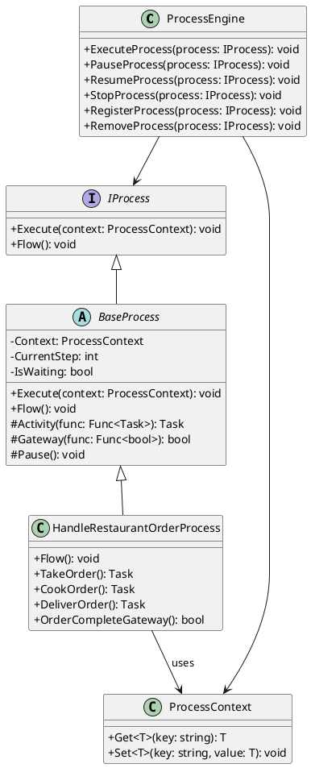

# Process Design Pattern (PDP)

## Introduction
The **Process Design Pattern (PDP)** introduces a structured way to explicitly define and manage workflows within software applications. It provides a formalized framework for modeling processes, ensuring they are clear, maintainable, and aligned with business needs. By treating processes as first-class entities, the PDP helps avoid implicit and scattered workflow logic, enabling better testing, debugging, and collaboration across development teams.

Unlike conventional approaches where workflows are embedded invisibly within components, the PDP emphasizes explicitly defining workflows as discrete, testable units. This approach not only improves software quality but also bridges the gap between business processes and their technical implementation.

---

## Pattern Name and Classification
- **Pattern Name:** Process Design Pattern (PDP)
- **Classification:** Behavioral Design Pattern
  - Focused on managing the behavior and interactions of software processes.
  - Related to patterns dealing with workflows, states, and decisions but introduces its own unique methodology. 

---

## Goal of the PDP
PDP aims to provide a reusable framework to:
- Model workflows explicitly within software applications.
- Manage the lifecycle and state of workflows in a predictable and testable manner.
- Facilitate alignment between software logic and real-world business processes.
- Improve code maintainability by centralizing and formalizing workflow definitions.

## Intent

PDP is designed to provide a clear and structured approach to defining, managing, and executing workflows within software applications. Its primary purpose is to:

- **Encapsulate workflows as formal entities:** By treating workflows as distinct, testable components, the PDP ensures they are explicitly defined and not implicitly embedded within code.
- **Bridge business logic and technical implementation:** Align software workflows with real-world processes to reduce errors and improve collaboration between developers and domain experts.
- **Improve maintainability and scalability:** By centralizing workflow logic, the PDP simplifies modifications and extensions, reducing the risk of introducing bugs.
- **Enhance testability:** Well-defined workflows can be tested independently of other components, ensuring correctness and stability.

PDP is particularly useful in applications where workflows are complex, dynamic, or tightly coupled to business processes. It provides a unified framework for modeling these workflows, enabling consistency and clarity across development teams.

## Also Known As

PDP may also be referred to as:

- **Workflow Design Pattern:** Emphasizing its focus on explicitly modeling and managing workflows in software.
- **Process-Oriented Design Pattern:** Highlighting its alignment with process-driven methodologies.
- **Process-Oriented Pattern:** A simpler alternative that stresses the process-centric nature of the pattern.
- **Process Pattern:** A concise term that captures the foundational idea of focusing on processes.
- **Software Workflow Framework:** Reflecting its utility as a framework for defining and executing workflows.
- **Explicit Workflow Pattern:** Underlining its approach to making workflows visible and formalized in code.

These alternative names capture the essence of the pattern, though **Process Design Pattern (PDP)** is preferred for its broad applicability and alignment with software design principles.

## Motivation (Forces)
### The Problem

In many software applications, workflows or processes are often implemented implicitly. The logic that defines these processes is scattered across various components, embedded within method calls, or even left undocumented, relying on the knowledge of individual developers. This approach leads to several challenges:

- **Lack of clarity:** The workflow is not easily visible or understandable without deep code analysis.
- **Difficult maintenance:** Modifying workflows requires navigating through scattered logic, increasing the risk of introducing bugs.
- **Limited testability:** Testing workflows becomes cumbersome when they are not encapsulated as discrete, testable entities.
- **Error-prone updates:** Without a clear structure, adding new features or modifying existing ones can disrupt the workflow, causing regressions.
- **Alignment issues:** The workflow in code may deviate from the actual business process, leading to inconsistencies.

### The Context

PDP is particularly effective in applications that:
- Automate parts of a business process or workflow.
- Involve complex decision-making, states, or dynamic interactions.
- Require clear documentation or alignment with real-world processes (e.g., warehouse management, order processing, or approval workflows).
- Demand high levels of maintainability and extensibility in their workflow implementations.

### How PDP Addresses the Problem

PDP resolves these challenges by:

1. **Centralizing workflow definitions:** Processes are explicitly defined, making them visible and comprehensible.
2. **Encapsulating workflows:** Each workflow is treated as a standalone entity, testable and modular.
3. **Formalizing state and decision logic:** By incorporating gateways, activities, and events, the PDP aligns closely with real-world processes, ensuring correctness and clarity.
4. **Enhancing maintainability:** Changes to the workflow can be made in a controlled, centralized manner, reducing the risk of errors.
5. **Improving collaboration:** Explicit workflows provide a common language for developers, domain experts, and stakeholders to align on process logic.

PDP provides a structured and robust solution to the problem of implicit, scattered, and opaque workflow logic, enabling better software design and process management.

## Applicability

The **Process Design Pattern (PDP)** is applicable in a wide range of scenarios, particularly those involving complex workflows, legacy codebases, and the need for alignment between business processes and software implementation. Below are key situations where the PDP can be effectively used:

### 1. **Complex or Dynamic Workflows**
When an application requires the management of workflows with multiple states, decision points, and activities, PDP provides a structured way to define, execute, and manage them. Examples include:
- Warehouse management systems.
- Order processing and fulfillment.
- Approval workflows in administrative or financial software.

### 2. **Legacy Codebases and Technical Debt**
In projects burdened with technical debt, such as:
- Legacy code with undocumented or implicit workflows.
- Spaghetti code where business logic is scattered across various components.
- Ad-hoc patches that deviate from stakeholder requirements.

PDP helps address these issues by forcing a reorganization of workflows into explicit, modular processes, reducing ambiguity and promoting maintainability.

### 3. **Business Process Automation**
Applications designed to automate business workflows, such as:
- ERP (Enterprise Resource Planning) systems.
- CRM (Customer Relationship Management) software.
- Supply chain or logistics applications.

PDP aligns the application's workflows with the stakeholder's requirements, ensuring accuracy and transparency.

### 4. **High Stakeholder Involvement**
When stakeholders demand:
- High visibility of the workflow logic to verify alignment with business processes.
- Clear documentation of processes to ensure understanding and approval.
- Easy adaptability to evolving business requirements.

PDP provides a direct link between the documented process and its implementation, enabling collaboration between developers and domain experts.

### 5. **Testability and Debugging**
In applications where workflow correctness is critical, PDP enables:
- Independent testing of workflows as isolated entities.
- Clear logging and tracking of process execution, facilitating debugging and monitoring.

### 6. **Reducing Risk in Large-Scale Projects**
For projects involving multiple teams or distributed development, PDP centralizes workflow logic, reducing the risk of uncoordinated changes and ensuring consistency across the application.

### Additional Benefits
Even though resolving technical debt is not PDP's primary focus, its application inherently leads to:
- Better-organized codebases.
- Modular and testable workflows.
- Enhanced alignment between the software's behavior and stakeholder expectations.

By explicitly defining and encapsulating workflows, PDP fosters better design practices, reduces the likelihood of errors, and creates a foundation for long-term scalability and maintainability.

### 7. **Reusability and Modularity**
PDP inherently supports the reusability of processes and the concept of sub-processes. This makes it ideal for applications where:
- **Shared Workflows**: Multiple parts of the application rely on the same underlying workflow logic (e.g., authentication flows, validation steps, or data synchronization).
- **Sub-Process Composition**: A process can encapsulate another process as a reusable building block, reducing redundancy and maintaining consistency.
- **Modular Design**: Processes can be independently developed, tested, and maintained, promoting a modular architecture.

By enabling processes to call or integrate other processes, PDP ensures that workflow logic remains DRY (Don't Repeat Yourself) and easily extendable for future needs.

## Structure

Below is a graphical representation of the **Process Design Pattern (PDP)**. It illustrates the relationship between processes, activities, gateways, and the process engine, using the example of a process for handling orders in a restaurant.


## Explanation
The diagram demonstrates:

- `ProcessEngine`: The core manager of processes, responsible for registering, executing, pausing, resuming, and removing processes. While theoretical support for PauseProcess and ResumeProcess exists, practical implementation requires careful handling of thread safety and consistency.
- `IProcess`: Defines the minimal contract for a process, including the Execute method and the Flow definition.
- `BaseProcess`: Provides a foundation for building processes, handling the state, context, and basic process activities.
- `HandleRestaurantOrderProcess`: A concrete process representing the handling of customer orders in a restaurant. It defines specific activities:
  - `TakeOrder`: Takes the customer's order.
  - `CookOrder`: Prepares the order.
  - `DeliverOrder`: Delivers the order to the customer.
  - `OrderCompleteGateway`: Checks if the order is completed.
- `ProcessContext`: Maintains the state and data of the process throughout its lifecycle.

This structure shows how the PDP can encapsulate complex workflows, maintain state, and allow for flexibility in managing processes. The ProcessEngine ensures a consistent way to control the lifecycle of any process.


#### Pseudocode for `Flow`:

The idea behind this approach is to mirror the structure of a process flow diagram as closely as possible. The use of `GOTO` statements and labels is intentional, serving as representations of arrows in the diagram. Each `GOTO` corresponds to a transition or flow in a process, and labels identify distinct steps or points in the diagram.

This definition is more about providing structured information for the process engine than creating a specific programming algorithm. The process engine interprets this representation and implements the necessary pauses, continuations, and decision-making logic based on the defined flow.

While the way the process is defined and implemented can vary depending on the developer's approach, PDP emphasizes defining the process in code as closely as possible to the diagram. This typically involves simple boxes for activities and arrows for transitions, maintaining a clear and intuitive connection between the diagram and its implementation.

Here’s an example definition for a restaurant order process:

```basic
SUB Flow()
    ' Begin the process
    START:
    Activity "Take Order"
    Pause

    ' Check if the order requires cooking
    IF Gateway "Order Requires Cooking" THEN
        Activity "Cook Order"
    END IF

    ' Deliver the order
    Activity "Deliver Order"

    ' Wait for delivery confirmation
    WAIT_FOR_DELIVERY:
    Pause

    ' Check if the order is complete
    IF Gateway "Order Complete" THEN
        GOTO PERFORM_CLOSE
    ELSE
        GOTO WAIT_FOR_DELIVERY
    END IF

    ' Close the order
    PERFORM_CLOSE:
    Activity "Close Order"

    ' Check for more orders
    Pause
    IF Gateway "More Orders" THEN
        GOTO START
    END IF

    ' End the process
    FINISH:
    Activity "Close Restaurant"
END SUB

```

This structure ensures that the code reflects the clarity and simplicity of a process flow diagram, making it easier to maintain, debug, and align with business requirements.

### Participants

The **Process Design Pattern (PDP)** involves several key participants, each playing a specific role in defining and executing the process:

1. **Process**:
   - Represents the core implementation of a specific process.
   - Encapsulates the logic for defining the process flow using methods like `Flow()` and contains activities, gateways, and pauses.
   - Implements the `IProcess` interface and defines its own unique behavior.

2. **Activity**:
   - Represents a step in the process where specific actions are executed.
   - Activities are executed sequentially or based on a condition, as defined in the process flow.
   - Typically modifies the process context or performs side effects such as triggering an external system or updating data.

3. **Gateway**:
   - Represents decision points in the process where alternate paths can be taken.
   - Evaluates conditions and determines the next step in the process flow.
   - Returns results such as `true`, `false`, or other basic data types to guide transitions.

4. **Pause**:
   - Represents a waiting point in the process where it halts execution until an external event occurs.
   - Emulates the behavior of a waiting event in a process flow diagram.
   - Helps align with real-world processes that require asynchronous user input or external system responses.

5. **Process Context**:
   - Stores data and state information relevant to the execution of the process.
   - Provides a way to pass and retrieve data between activities, gateways, and other components.

6. **Process Engine**:
   - Manages the execution and lifecycle of processes.
   - Interprets the `Flow()` definition and handles activities, gateways, pauses, and resumptions.
   - Ensures that the process can pause and resume while maintaining consistency.
   - Tracks and cleans up processes after they complete.

7. **Listeners and Events**:
   - Listeners are components that monitor process events and act upon them.
   - Events are signals or messages exchanged between the process and external systems, triggering specific actions or resuming paused processes.

8. **Developers** (Optional but important):
   - Responsible for defining process flows in a structured manner using the PDP principles.
   - Must align the process definition with its corresponding diagram for clarity and maintainability.

Each of these participants contributes to a cohesive and maintainable implementation of process logic, ensuring that the code structure remains aligned with the conceptual flow of the business process.

### Collaboration

In the **Process Design Pattern (PDP)**, the interaction between the participants ensures that the process flow is executed as defined and remains consistent with the business logic. The following describes the collaboration between the key components:

1. **Process and Process Engine**:
   - The `Process` defines the flow of steps (`Activity`, `Gateway`, `Pause`) in its `Flow()` method.
   - The `Process Engine` interprets the process definition and manages its lifecycle, including executing steps, handling pauses, and resuming execution after an event is received.

2. **Process and Process Context**:
   - The `Process Context` acts as a shared state container for the process.
   - `Activities` and `Gateways` interact with the `Process Context` to store and retrieve data that is essential for decision-making and process execution.

3. **Process and Activities**:
   - `Activities` are methods defined within the process that represent executable steps.
   - The `Process Engine` calls these activities sequentially or conditionally, based on the `Flow()` definition.

4. **Process and Gateways**:
   - `Gateways` are decision points in the process. They evaluate conditions and return results to guide the next step.
   - The `Process Engine` executes gateways and uses their results to determine the subsequent activity or pause.

5. **Process and Pause**:
   - A `Pause` halts the process execution at a specific step, awaiting an external event to resume.
   - The `Process Engine` tracks the paused state and ensures that execution resumes from the correct point when the event is received.

6. **Listeners and Events**:
   - Listeners register with the process to monitor specific events.
   - External systems or user actions emit events that the process listens to, allowing it to resume from a paused state or trigger specific actions.

7. **Developers and Diagrams**:
   - Developers translate business process diagrams into process definitions using the PDP principles.
   - The close alignment between diagrams and code ensures clarity and maintainability, making collaboration between stakeholders and developers seamless.

8. **Process Reusability**:
   - Processes can call or trigger other processes, promoting modularity and reusability.
   - The `Process Engine` handles these interactions, ensuring that sub-processes execute independently yet cohesively.

This collaboration ensures that the process logic remains decoupled, maintainable, and testable while faithfully representing the intended business flow.

### Consequences

The **Process Design Pattern (PDP)** brings numerous benefits, along with some trade-offs that need to be considered. Below is a detailed description of the results, side effects, and trade-offs of implementing PDP:

#### Benefits

1. **Explicit Process Representation**:
   - Processes are defined in a structured and clear manner, resembling business process diagrams (e.g., BPMN).
   - This explicit representation reduces ambiguity and aligns implementation with stakeholder expectations.

2. **Improved Maintainability**:
   - The separation of process logic from component-level implementation ensures that changes to the business flow can be made with minimal impact on the underlying components.
   - Modular processes simplify debugging and testing.

3. **Enhanced Testability**:
   - Processes can be unit-tested independently.
   - Gateways, activities, and pauses can be validated for correctness in isolation.

4. **Encapsulation of Business Logic**:
   - By centralizing process definitions, business rules are less likely to be scattered across the codebase, improving consistency.

5. **Facilitation of Technical Debt Repayment**:
   - PDP enforces structure, helping teams refactor legacy systems, untangle spaghetti code, and align implementations with business objectives.

6. **Modularity and Reusability**:
   - Processes can call or include sub-processes, promoting code reuse and reducing duplication.
   - Activities and gateways can be shared across multiple processes.

#### Trade-offs

1. **Initial Learning Curve**:
   - Developers new to PDP may require time to understand its principles and the distinction between defining a process and implementing its steps.

2. **Performance Overhead**:
   - The process engine introduces an additional layer of abstraction. Features like pauses and event handling may incur slight runtime overhead.
   - Complex processes with frequent pauses and resumes might require careful optimization.

3. **Effort in Process Modeling**:
   - Accurately defining processes, especially for complex workflows, can take more time upfront.
   - Misalignment between diagrams and definitions can introduce errors.

4. **Increased Development Effort**:
   - Compared to embedding business logic directly into components, using PDP requires additional effort to set up the process engine and define flows.

5. **Integration Challenges**:
   - Integrating PDP with existing systems or frameworks might require significant adaptation, especially in monolithic or tightly coupled codebases.

6. **Abstraction Risks**:
   - Over-abstraction of process logic may lead to reduced flexibility if not handled carefully.
   - Misuse of gateways or overly complex flows can make processes harder to understand and maintain.

The **Process Design Pattern** is a powerful tool for structuring, maintaining, and testing business-oriented applications. While it introduces some trade-offs, the benefits of explicit process representation, modularity, and alignment with business goals often outweigh the costs in scenarios where processes are central to the application.

### Implementation

The **Process Design Pattern (PDP)** is implemented by defining processes explicitly and allowing a process engine to execute, pause, and resume them based on their definitions. Below is a description of the main components of the implementation and how they fit together.

#### Key Components

1. **Process Definitions**:
   - Processes are defined as methods that describe their flow using simple constructs such as activities, gateways, and pauses.
   - Each step in the process is treated as a distinct action, decision, or event.

2. **Process Engine**:
   - A central engine interprets process definitions and manages their execution.
   - Responsibilities include:
     - Tracking the current state of a process.
     - Handling pauses and resumptions.
     - Managing transitions between activities and gateways.
     - Ensuring thread safety and consistency during execution.

3. **Activity and Gateway Methods**:
   - Activities are individual tasks performed as part of the process. They are typically asynchronous and modify the process context.
   - Gateways represent decision points. They return simple values (e.g., `true`/`false`, or strings) that guide the flow based on conditions.

4. **Pause and Event Handling**:
   - A `Pause` construct halts process execution and raises an exception to signal the process engine.
   - The engine listens for external events to resume execution from the paused state.

5. **Thread Safety**:
   - The process engine ensures that concurrent access to process states and context is safe, using techniques like locks or synchronization mechanisms.

#### Implementation Steps

1. **Define the Process Flow**:
   - Use a method (e.g., `Flow()`) to define the steps of the process.
   - Example:
     ```csharp
     protected override async Task Flow()
     {
         await Activity(TakeOrder);

         await Pause();

         if (await Gateway(OrderRequiresCooking))
         {
             await Activity(CookOrder);
         }

         await Activity(DeliverOrder);

         await Pause();

         if (await Gateway(OrderComplete))
         {
             await Activity(CloseOrder);
         }
     }
     ```

2. **Implement Activities and Gateways**:
   - Activities perform discrete tasks and may modify the process context.
   - Gateways evaluate conditions and guide the flow.
   - Example:
     ```csharp
     [ProcessActivity]
     private async Task TakeOrder()
     {
         Console.WriteLine("Taking the order...");
         await Task.Delay(1000); // Simulate task duration
     }

     [ProcessGateway]
     private async Task<bool> OrderRequiresCooking()
     {
         return true; // Simulate condition
     }
     ```

3. **Integrate with a Process Engine**:
   - The process engine manages execution:
     - Tracks the current step using line numbers or unique step IDs.
     - Resumes execution upon receiving the required event.
     - Handles concurrency and ensures thread safety.
   - Example:
     ```csharp
     public async Task Execute(ProcessContext context)
     {
         CurrentContext = context;
         try
         {
             await Flow();
         }
         catch (ProcessPauseException)
         {
             // Handle pause
         }
     }
     ```

4. **Handle Events**:
   - Define a listener mechanism to capture events and resume processes.
   - Example:
     ```csharp
     public async Task Listen(Word eventName)
     {
         if (IsWaitingFor(eventName))
         {
             await Execute(CurrentContext);
         }
     }
     ```

5. **Test and Validate**:
   - Use automated tests to ensure that processes behave as expected.
   - Test individual activities and gateways, as well as complete process flows.

#### Notes on Flexibility

- **Custom Implementations**:
  - The process engine can be adapted to specific frameworks or languages.
  - For example, a Java or Python implementation could leverage similar principles but use language-specific constructs.

- **Integration with Existing Systems**:
  - PDP can complement methodologies like Behavior-Driven Development (BDD) by aligning process definitions with user stories.

The implementation of the **Process Design Pattern** provides a structured, maintainable approach to defining and executing processes. It abstracts business flows into manageable units while allowing developers to focus on implementing individual steps and decisions within a clear framework.

### Sample Code

To see practical examples of the **Process Design Pattern (PDP)** in action, including fully implemented process definitions, activity methods, and a process engine, please refer to the example code in the repository.

#### Repository Links:
- **[Process Design Pattern Examples](#)**: Detailed examples showcasing various processes such as handling restaurant orders, task management, and more.
- **[Process Engine Implementation](#)**: The core implementation of the process engine with features like pause, resume, and event handling.

#### Examples Included in the Repository:
1. **Restaurant Order Process**:
   - Demonstrates the flow of taking an order, cooking if required, delivering, and closing the order.

2. **Warehouse Management Process**:
   - A more complex process handling inventory, order picking, and shipment tracking.

3. **Simple Onboarding Process**:
   - A straightforward example of user onboarding with activities, gateways, and pauses.

By examining the sample code in the repository, you can understand how the pattern can be applied in real-world scenarios and adapted to your specific needs.

### Known Uses

The **Process Design Pattern (PDP)** is a new contribution to the landscape of software design patterns. While it has not yet been widely adopted, it has been specifically developed to address the challenges of defining, maintaining, and executing explicit processes within applications.

#### Current Applications
- **Internal Projects**: PDP has been implemented in an internal system for managing workflows in a production-grade warehouse management application. Due to confidentiality, specific details cannot be disclosed, but the pattern has shown to improve process visibility, maintainability, and testability.
- **Prototyping and Experimentation**: Early adopters and contributors are exploring PDP in domains such as task management, order processing, and user onboarding workflows.

#### Opportunities for Adoption
Given its emphasis on aligning application processes with business workflows, PDP holds potential for:
- **Business Process Automation**: Streamlining operations in domains like retail, logistics, and manufacturing.
- **Highly Regulated Environments**: Ensuring compliance by explicitly defining processes in applications (e.g., finance, healthcare).
- **Legacy Code Refactoring**: Replacing hidden or implicit workflows with explicit, testable, and maintainable processes.

As the pattern gains visibility, we expect more widespread adoption and integration into various software projects. Contributions, feedback, and examples of usage are encouraged to help refine and evolve the pattern.

### Related Patterns

The **Process Design Pattern (PDP)** shares similarities with several existing design patterns and methodologies but also has unique distinctions that set it apart. Below is a discussion of related patterns and their differences:

#### 1. **Coordinator Pattern**
- **Similarity**: Both patterns focus on managing interactions and workflows between components.
- **Difference**: The Coordinator Pattern is primarily concerned with controlling navigation or transitions, often in UI-focused applications. PDP extends this by explicitly modeling and executing processes, including activities, gateways, and events, in a manner analogous to BPMN diagrams.

#### 2. **State Machine Pattern**
- **Similarity**: Both manage transitions and define rules for moving between states or steps.
- **Difference**: PDP focuses on modeling workflows that may include waiting for external events or decisions, which go beyond simple state transitions. While state machines are ideal for deterministic, finite states, PDP accommodates more dynamic, process-driven flows.

#### 3. **Business Process Management (BPM) Frameworks**
- **Similarity**: Both aim to define, model, and execute workflows. PDP draws inspiration from BPMN for its visual clarity and structured approach.
- **Difference**: PDP is a software design pattern for embedding process logic directly in application code, whereas BPM frameworks are often external systems designed for managing business processes at an enterprise level.

#### 4. **Chain of Responsibility**
- **Similarity**: Both involve sequential steps where each step performs a task and determines the next step.
- **Difference**: PDP explicitly defines steps and decision points, making the flow highly transparent and testable, while the Chain of Responsibility often hides the decision-making process within handlers.

#### 5. **Template Method**
- **Similarity**: Both involve defining a skeleton of steps for an algorithm or workflow.
- **Difference**: PDP provides more flexibility and dynamism, allowing for pauses, gateways, and event-driven execution, whereas the Template Method is static and linear.

#### 6. **Event-Driven Architecture**
- **Similarity**: PDP relies on events to trigger pauses and resumes in the workflow.
- **Difference**: PDP formalizes workflows and integrates event handling within a structured process definition, whereas event-driven architecture focuses on reacting to events independently, often without a predefined workflow.

#### Summary
PDP borrows elements from these patterns and frameworks but distinguishes itself by its explicit alignment with process-oriented design. It addresses specific challenges in making application workflows transparent, maintainable, and testable, bridging the gap between process modeling (e.g., BPMN) and software implementation.

## Authorship

The **Process Design Pattern (PDP)** was conceptualized and developed by Rafa Rodriguez. If you have questions or suggestions, feel free to contact me: [rafageist.com](https://rafageist.com).

## License

This project is licensed under the [MIT License](LICENSE). You are free to use, modify, and distribute this work, provided proper attribution is given.

## Contributing

Contributions are welcome! If you have ideas, improvements, or new implementations for the Process Design Pattern, feel free to:
1. Fork this repository.
2. Create a feature branch (`git checkout -b idea/my-idea`).
3. Commit your changes (`git commit -am 'This is my idea'`).
4. Push to the branch (`git push origin idea/my-idea`).
5. Open a pull request.

Please make sure to follow the contribution guidelines outlined in the [CONTRIBUTING.md](CONTRIBUTING.md).

## Invitation to the Community

The Process Design Pattern is a collaborative effort to formalize and advance process-oriented design in software engineering. Whether you are a developer, architect, or academic, your insights are invaluable.

Join us in:
- Discussing the theory and applications of PDP.
- Providing feedback on the pattern and its implementations.
- Sharing use cases and improvements for broader adoption.

Let’s make PDP accessible and effective for all!
